
<h1>Keycloak tutorial</h1>
<h6>All what you need about keycloak</h6>

<h3>What is keycloak ?</h3>

<color style="color: cadetblue" >Keycloak</color> is an open-source Identity and Access Management (IAM) 
solution designed to secure modern applications and services with ease. Developed by Red Hat, 
Keycloak provides a comprehensive set of features for managing user identities, enabling single sign-on (SSO),
and handling authorization in a secure and scalable manner.
Key features of Keycloak include:

1. **Single Sign-On (SSO):** Keycloak allows users to log in once and access multiple applications without the need to re-enter credentials.

2. **User Federation:** It supports integration with external identity providers, LDAP directories, and various user databases, enabling centralized user management.

3. **Authentication and Authorization:** Keycloak offers a flexible and customizable authentication framework, supporting various authentication methods. It also provides robust authorization mechanisms, allowing fine-grained control over user access.

4. **Social Identity Providers:** Integration with popular social media platforms for user authentication and identity federation.

5. **Open Standards:** Keycloak adheres to open standards such as OAuth 2.0 and OpenID Connect, ensuring interoperability and compatibility with a wide range of applications.

6. **Security and Token Management:** It handles the generation and validation of security tokens, including JSON Web Tokens (JWTs), to secure communication and ensure data integrity.

<h3>Download Keycloak</h3>

You can download keycloak with the link below

<a href="https://www.keycloak.org/downloads-archive.html">download keycloak</a>
<h3>Start Keycloak</h3>

Start the keycloak with this command <color  style="color: cadetblue">kc.bat start-dev </color>

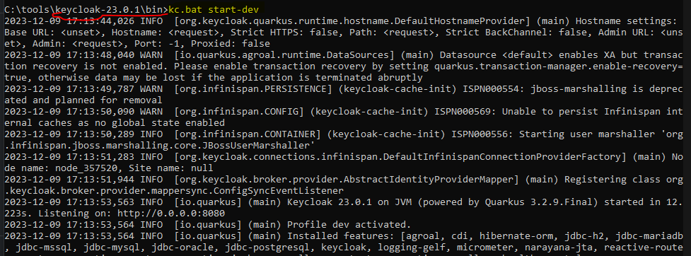
<h3>Create an Admin account</h3>

Go to the browser and consulter "localhost:8080", the keycloak will open, then create an admin account

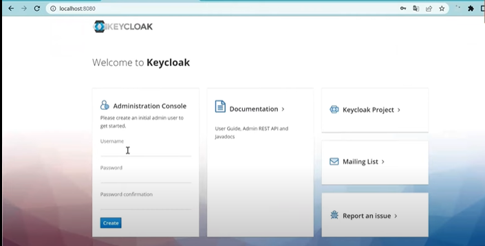

After that click "Administration console", log-in with your admin account that you created before

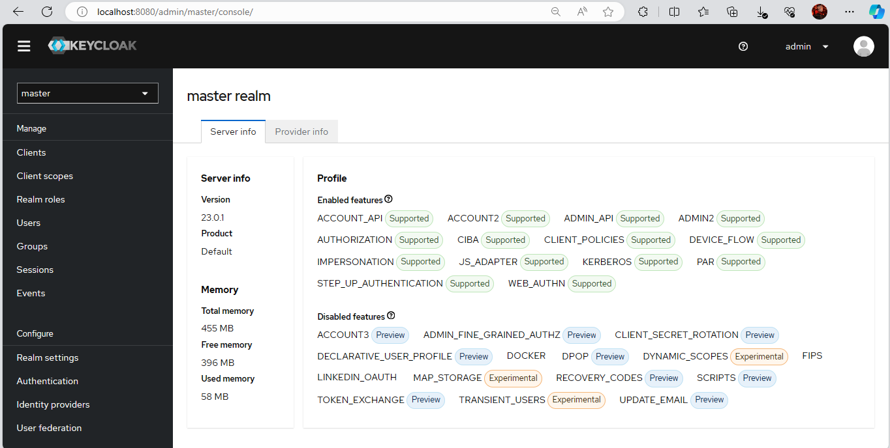
<h3>Create a Realm</h3>

Realm is a secure region that contains multiple applications to secure.

In Keycloak, a realm is indeed a secure area that encompasses users, roles, and applications,
providing a way to manage and secure access to those applications.
Each realm is independent, and the security configurations within one realm do not impact another. 
Realms allow you to create isolated security domains where you can define authentication 
and authorization settings specific to a set of applications.

Click master, then create realm, then insert the realm name and click create

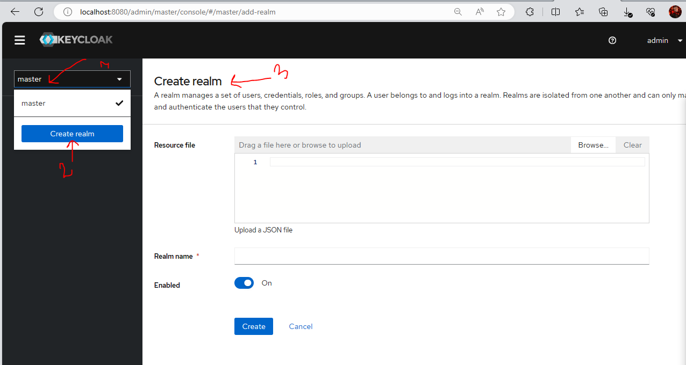
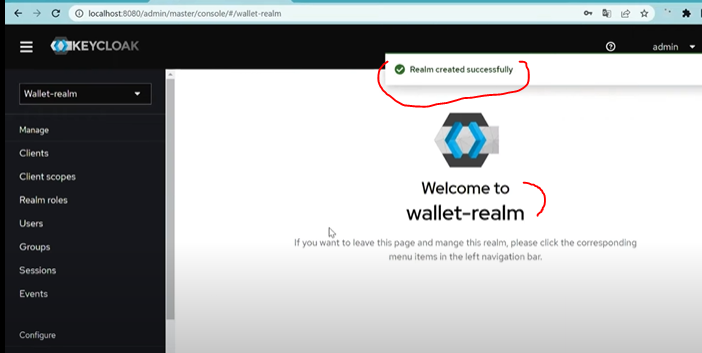

We will now create the applications to secure, so we need to create clients

<h3>Create a client to secure</h3>

for example i want to secure an application wallet so im going to create a wallet-client

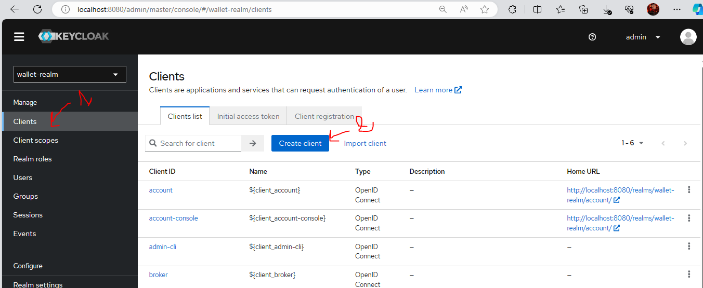
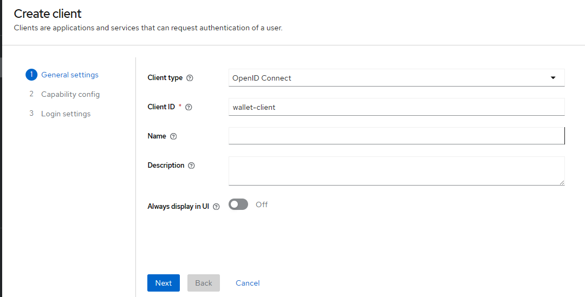

You can click next and next, now we don't need this options, if we create our application then we will change all what we need to

- **Home URL:** The Home URL is the base URL of the client application where users are redirected after a successful login.

- **Valid Redirect URIs:** These are the allowed URLs to which Keycloak can redirect users after authentication. Ensure that these URIs match the expected redirection endpoints in your client application.

- **Valid Post Logout Redirect URIs:** Specifies the URLs to which users are redirected after logging out from the client application, providing a seamless logout experience.

- **Web Origins:** It defines the allowed origins (domains) from which browsers can make requests to the client. This helps prevent unauthorized cross-origin requests and enhances security.</pre>

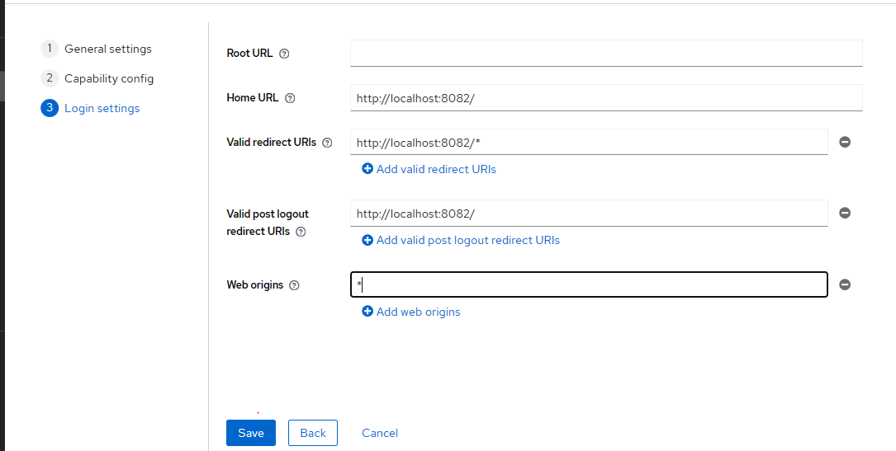

click next then save

<h3>Create users</h3>
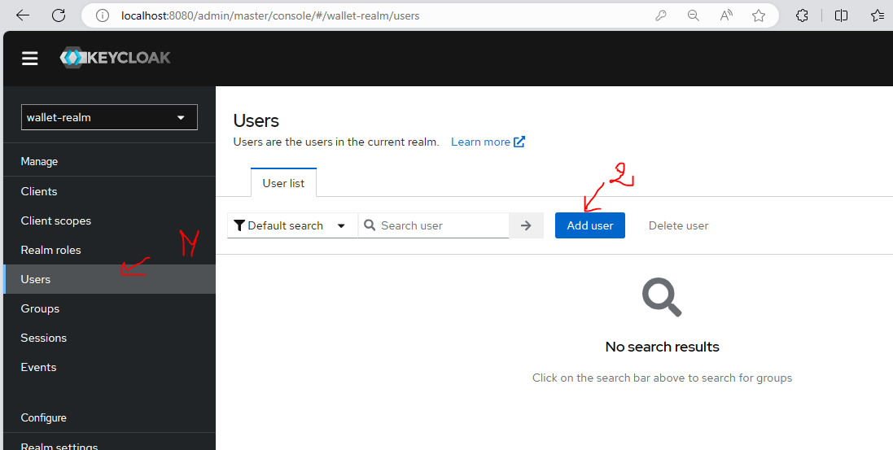
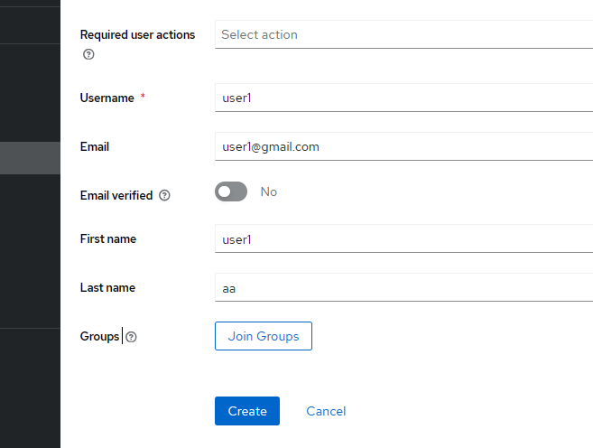

Add a password to our user

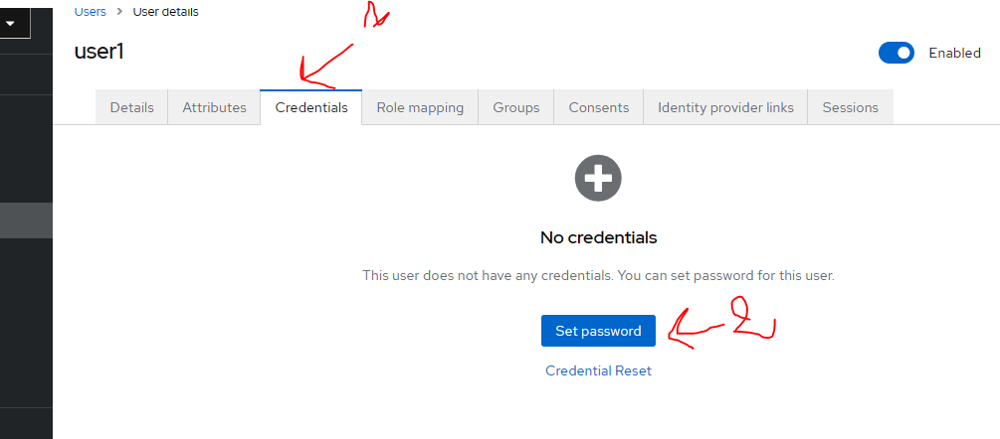
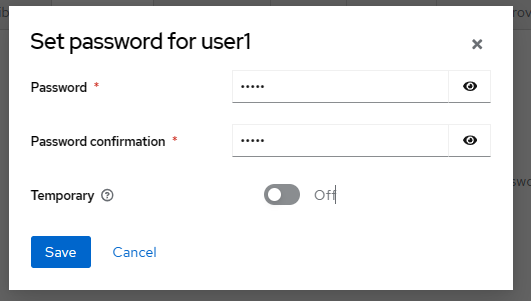

In the context of setting a temporary password for a user, 
it typically means assigning a password that is meant to be used temporarily 
and requires the user to change it upon their first login. 
This practice enhances security by ensuring that 
the initial password provided by an administrator or system is only valid for a short period, 
encouraging users to create a unique and secure password of their own.

To create another user, follow the same steps as before.

<h3>Create roles</h3>
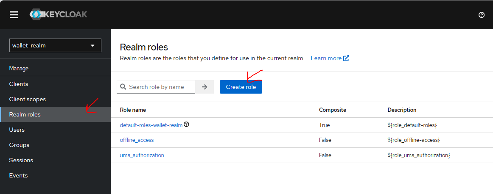

I created 2 roles USER and ADMIN

<h3>Assign roles to users</h3>

Assign ADMIN and USER roles to User1, USER role to User2

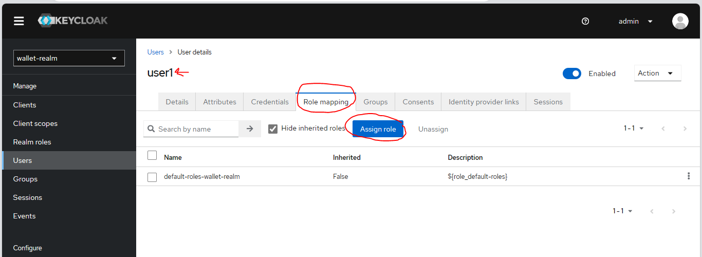
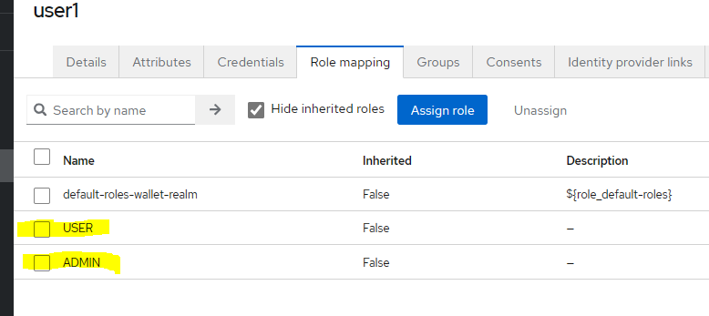
<h3>With Postman:</h3>

Test with Postman

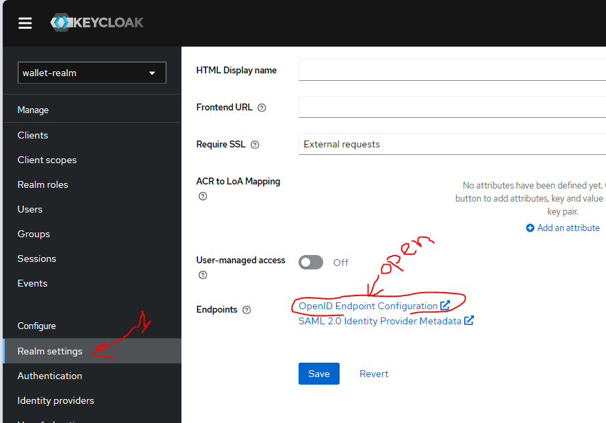
Get the token endpoint url and put it in postman
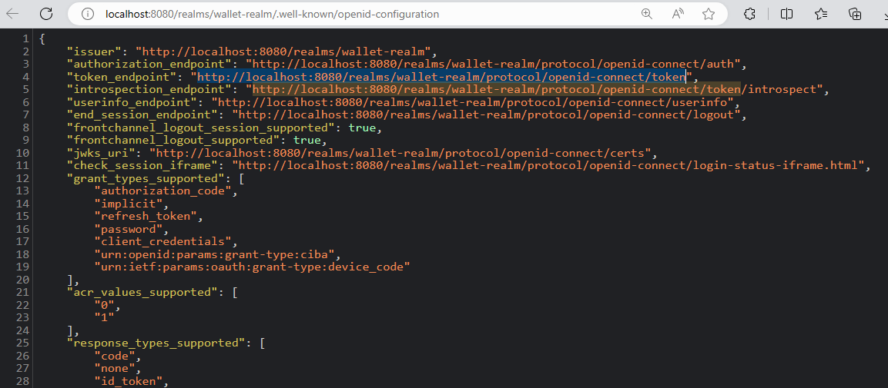

- **The Token Endpoint :** is a specific URL where applications, such as Postman, 
interact with the authentication server, 
like Keycloak, to request and obtain access tokens and refresh tokens.
It serves as a gateway for securely exchanging authentication information,
enabling authorized access to protected resources.

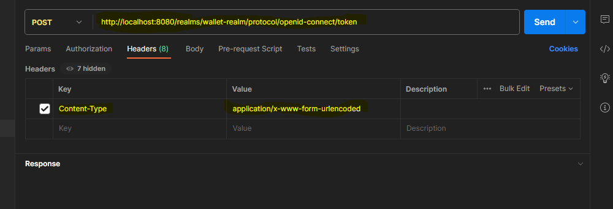
<h5>Test authentication with the password</h5>
grant_type: i want to authentic by password
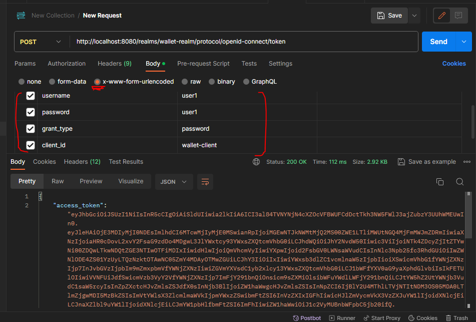
The response contains the Access Token and Refresh Token in JWT format.
<h5>Analyze the contents of both JWT Access Token and Refresh Token</h5>
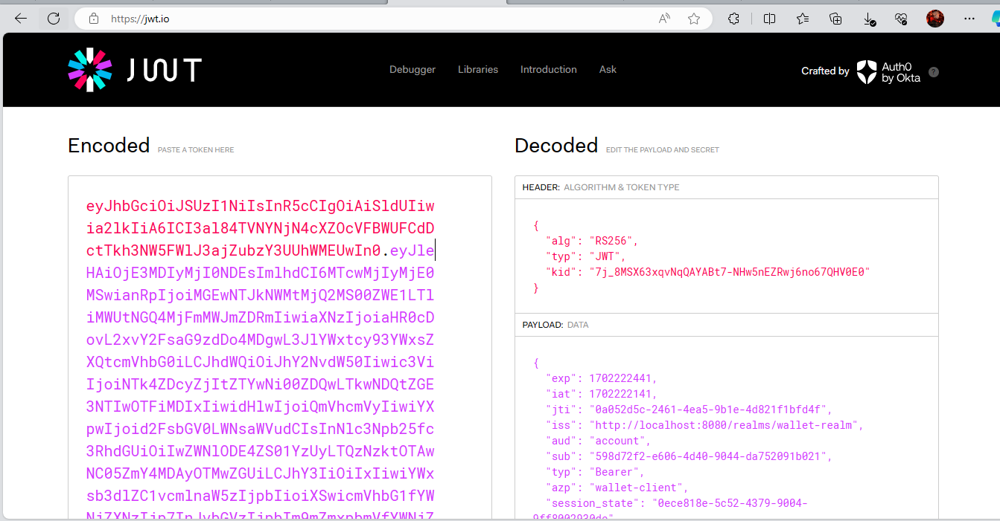

<color style="color:olivedrab" >An access token </color>is a cryptographic token that represents the authorization granted to a client application to access 
specific resources on behalf of a user. In the context of OAuth 2.0 and OpenID Connect (OIDC), 
access tokens are issued by an authorization server (such as Keycloak) 
after a successful authentication and authorization process.

Key points about access tokens:

1. **Purpose:** Access tokens are used to access protected resources, such as APIs or services, on behalf of the user.

2. **Lifetime:** They have a finite lifespan, and their duration is determined by the authorization server. After expiration, a new access token must be obtained.

3. **Security:** Access tokens are typically bearer tokens, meaning that possession of the token alone is sufficient for access. Therefore, it is crucial to secure access tokens and transmit them over HTTPS.

4. **Claims:** Access tokens often contain claims (pieces of information) about the user and their permissions, encoded in a structured format like JSON Web Tokens (JWT).

5. **Use Cases:** Access tokens are commonly employed in scenarios like mobile app authentication, API access, and single sign-on (SSO) to enable secure and controlled resource access.

Some content of the token 

- **"iat": 1702222141:**
"Issued At": Indicates the timestamp (in seconds since the Unix epoch) when the token was issued by the authorization server.
- **"jti": "0a052d5c-2461-4ea5-9b1e-4d821f1bfd4f":**
"JWT ID": A unique identifier for the JWT. Helps to prevent token reuse and duplication.
- **"iss": "http://localhost:8080/realms/wallet-realm":**
"Issuer": Specifies the issuer (authorization server) of the JWT.
- **"aud": "account":** "Audience": Identifies the recipient that the JWT is intended for. In this case, it is the "account" service.
- **"sub": "598d72f2-e606-4d40-9044-da752091b021":** "Subject": Represents the subject of the JWT, typically the unique identifier of the authenticated user.
- **"typ": "Bearer":** "Token Type": Specifies the type of token. In this case, it is a bearer token, indicating that possession of the token is sufficient for access.
- **"azp": "wallet-client":** "Authorized Party": Identifies the client that is authorized to use the issued token.
- **"session_state": "0ece818e-5c52-4379-9004-...":** "Session State" : Represents the unique identifier for the user's session (Client Id). It helps manage the user's state across different authentication sessions.

The roles of user

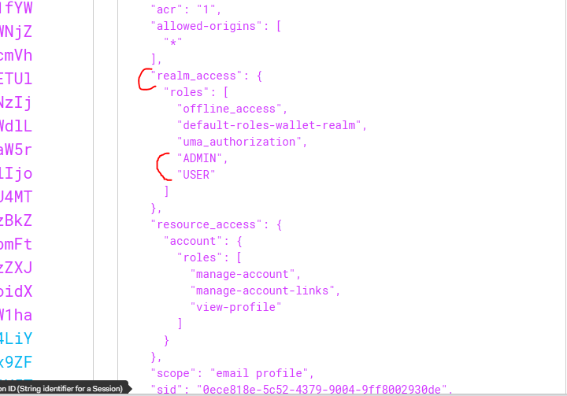
<h6>You can find the information about the tokens in keycloak, you can change it too</h6>
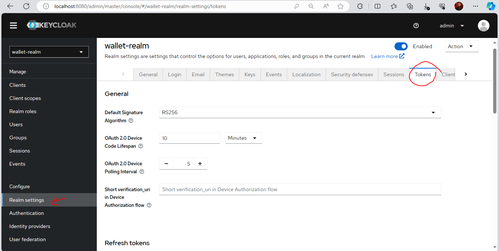
<h5>Test authentication with the Refresh Token</h5>
We can request another access token by using the refresh token obtained from the last POST request.
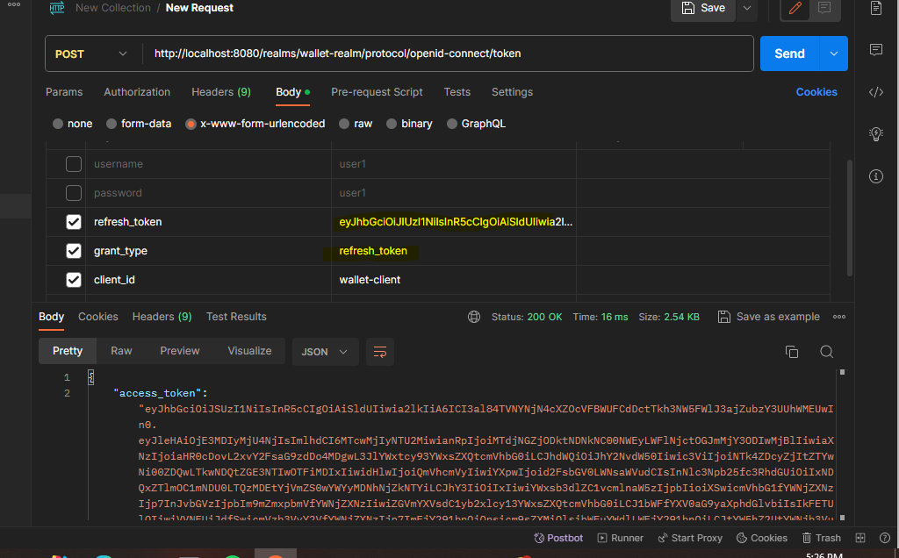
<h5>Test authentication with Client ID and Client Secret</h5>
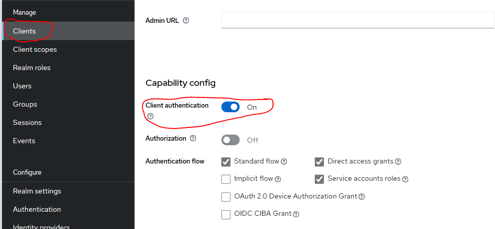
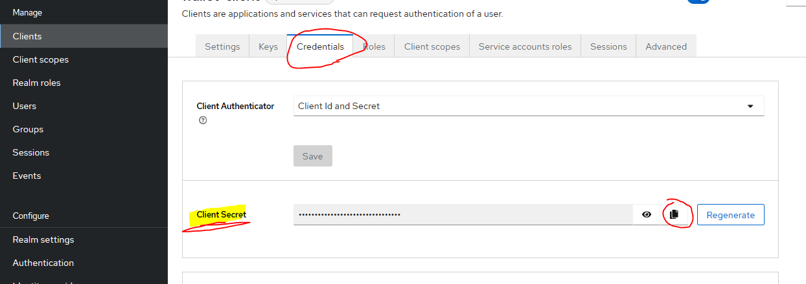
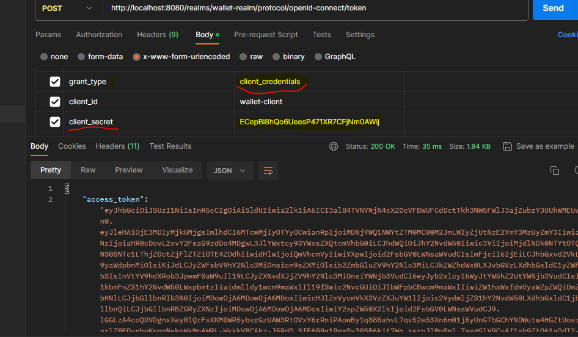
<h1>Keycloak with docker</h1>

docker run -p 8080:8080 -e KEYCLOAK_ADMIN=admin -e KEYCLOAK_ADMIN_PASSWORD=admin quay.io/keycloak/keycloak:23.0.1 start-dev

Click the link to see more details

<a href="https://www.keycloak.org/getting-started/getting-started-docker">Get started with Keycloak on Docker</a>